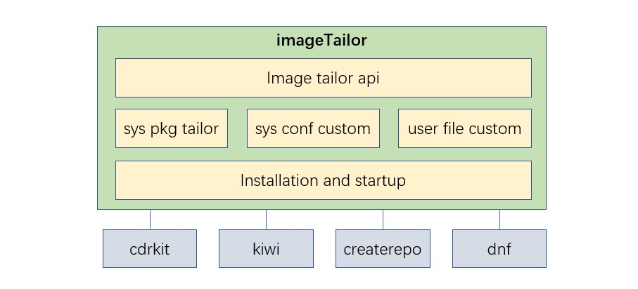

# imageTailor设计

## 一、概述

### 1.目的

本文档主要针对imageTailor特性功能进行设计，明确特性功能实现原理级内部各个组件之间的关联设计，明确主要数据结构和主要处理过程，作为今后的编码阶段的输入和编码人员、测试人员的指导。

### 2.范围

本设计主要实现imageTailor特性功能框架，主要包括系统包裁剪定制模块、系统配置定制模块、用户文件定制模块、安装启动模块。

## 二、特性列表

<table>
<tr>
    <th>编号</th>
    <th>特性名称</th>
    <th>特性描述</th>
</tr>
<tr>
    <td>1</td>
    <td>系统包裁剪定制</td>
    <td>用户可以选择默认安装级裁剪的rpm。 支持用户定制裁剪系统命令、库、驱动。</td>
</tr>
<tr>
    <td>2</td>
    <td>系统配置定制</td>
    <td>用户可以配置主机名、启动服务、时区、网络、分区、加载驱动、版本号等。</td>
</tr>
<tr>
    <td>3</td>
    <td>用户文件定制</td>
    <td>支持用户添加定制文件到系统镜像中。</td>
</tr>
<tr>
    <td>4</td>
    <td>安装启动</td>
    <td>系统安装引导方式支持pxe和光驱。 系统启动引导方式支持硬盘。</td>
</tr>
</table>

## 三、场景分析

### 1.需求来源及价值概述

操作系统除内核外，还包含大量各种功能的外围包。因此，操作系统功能多、占用资源多，这带来了两方面的影响： 
第一：大量占用有限的内存、磁盘、CPU等资源，导致系统运行低效。 
第二：很多功能客户完全用不到、不感知，浪费版本开发和维护成本。 
操作系统镜像文件级裁剪特性正是基于这样的现状提出。可以根据客户的需求量身打造操作系统，不仅可以裁剪不需要的外围包、驱动等，还可以添加自己的业务包、用户自定义文件等。

### 2.使用场景

imageTailor工具用于产品开发环境，用来生成用户自定义操作系统镜像文件，生成的镜像文件经过测试后可能会在生产环境中进行部署，但工具本身并不在现网运行。

### 3.特性影响分析
imageTailor约束及限制： 
第一：imageTailor属于开发工具，用于研发环境下裁剪定制操作系统镜像，不能在现网环境运行。 
第二：定制生成的镜像引导模式只支持UEFI。 
第三：定制生成的镜像安装介质只支持pxe和光驱。 
第四：定制生成的镜像启动介质只支持硬盘。 
第五：支持aarch64和x86_64两个架构。

## 四、架构/实现

imageTailor特性功能主要分为四部分：系统包裁剪定制、系统配置定制、用户文件定制、安装启动，下层需要依赖到kiwi、cdrkit、createrepo、dnf等开源软件工具。 
系统包裁剪定制、系统配置定制通过conf文件进行管理，用户可根据自身需求进行配置。 
用户文件定制需要用户按linux目录结构进行文件存放，并设定好文件权限，对文件形式和内容无任何限制，可以是安装脚本、配置文件或其它文件，只要是用户提供的文件都会按用户指定的目录和权限制作到OS中。 

