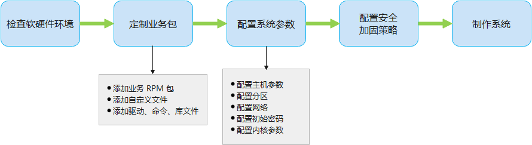

# imageTailor 使用指南

- [简介](#简介)
- [安装工具](#安装工具)
  - [软硬件要求](#软硬件要求)
  - [获取安装包](#获取安装包)
  - [安装 imageTailor](#安装-imageTailor)
  - [目录介绍](#目录介绍)
- [定制系统](#定制系统)
  - [总体流程](#总体流程)
  - [定制业务包](#定制业务包)
    - [配置本地 repo 源](#配置本地-repo-源)
    - [添加文件](#添加文件)
    - [添加 RPM 包](#添加-RPM-包)
    - [添加 hook 脚本](#添加-hook-脚本)
  - [配置系统参数](#配置系统参数)
    - [配置主机参数](#配置主机参数)
    - [配置初始密码](#配置初始密码)
    - [配置分区](#配置分区)
    - [配置网络](#配置网络)
    - [配置内核参数](#配置内核参数)
  - [制作系统](#制作系统)
    - [命令介绍](#命令介绍)
    - [制作指导](#制作指导)
  - [裁剪时区](#裁剪时区)
  - [定制示例](#定制示例)


## 简介

操作系统除内核外，还包含各种功能的外围包。通用操作系统包含较多外围包，提供了丰富的功能，但是这也带来了一些影响：

- 占用资源（内存、磁盘、CPU 等）多，导致系统运行效率低
- 很多功能用户不需要，增加了开发和维护成本

因此，openEuler 提供了 imageTailor 镜像裁剪定制工具。用户可以根据需求裁剪操作系统镜像中不需要的外围包，或者添加所需的业务包或文件。该工具主要提供了以下功能：

- 系统包裁剪定制：用户可以选择默认安装以及裁剪的rpm，也支持用户裁剪定制系统命令、库、驱动。
- 系统配置定制：用户可以配置主机名、启动服务、时区、网络、分区、加载驱动、版本号等。
- 用户文件定制：支持用户添加定制文件到系统镜像中。


## 安装工具

本节以 openEuler 22.03 LTS 版本 AArch64 架构为例，说明安装方法。

### 软硬件要求

安装和运行 imageTailor 需要满足以下软硬件要求：

- 机器架构为 x86_64 或者 AArch64

- 操作系统为 openEuler 22.03 LTS（该版本内核版本为 5.10，python 版本为 3.9，满足工具要求）

- 运行工具的机器根目录 '/' 需要 40 GB 以上空间

- python 版本 3.9 及以上

- kernel 内核版本 5.10 及以上

- 关闭 SElinux 服务

  ```shell
  $ sudo setenforce 0
  $ getenforce 
  Permissive
  ```


### 获取安装包

安装和使用 imageTailor 工具，首先需要下载 openEuler 发布件。

1. 获取 ISO 镜像文件和对应的校验文件。

   镜像必须为 everything 版本，此处假设存放在 root 目录，参考命令如下：

   ```shell
   $ cd /root/temp
   $ wget https://repo.openeuler.org/openEuler-22.03-LTS/ISO/aarch64/openEuler-22.03-LTS-everything-aarch64-dvd.iso
   $ wget https://repo.openeuler.org/openEuler-22.03-LTS/ISO/aarch64/openEuler-22.03-LTS-everything-aarch64-dvd.iso.sha256sum
   ```

3. 获取 sha256sum 校验文件中的校验值。

   ```shell
   $ cat openEuler-22.03-LTS-everything-aarch64-dvd.iso.sha256sum
   ```

4. 计算 ISO 镜像文件的校验值。

   ```shell
   $ sha256sum openEuler-22.03-LTS-everything-aarch64-dvd.iso
   ```

5. 对比上述 sha256sum 文件的检验值和 ISO 镜像的校验值，如果两者相同，说明文件完整性检验成功。否则说明文件完整性被破坏，需要重新获取文件。

### 安装 imageTailor

此处以 openEuler 22.03 LTS 版本的 AArch64 架构为例，介绍如何安装 imageTailor 工具。

1. 确认机器已经安装操作系统 openEuler 22.03 LTS（ imageTailor 工具的运行环境）。

   ```shell
   $ cat /etc/openEuler-release
   openEuler release 22.03 LTS
   ```

2. 创建文件 /etc/yum.repos.d/local.repo，配置对应 yum 源。配置内容参考如下，其中 baseurl 是用于挂载 ISO 镜像的目录：

   ```shell
   [local]
   name=local
   baseurl=file:///root/imageTailor_mount
   gpgcheck=0
   enabled=1
   ```

3. 使用 root 权限，挂载光盘镜像到 /root/imageTailor_mount 目录（请与上述 repo 文件中配置的 baseurl 保持一致，且建议该目录的磁盘空间大于 20 GB）作为 yum 源，参考命令如下：

   ```shell
   $ mkdir /root/imageTailor_mount
   $ sudo mount -o loop /root/temp/openEuler-22.03-LTS-everything-aarch64-dvd.iso /root/imageTailor_mount/
   ```

4. 使 yum 源生效：

   ```shell
   $ yum clean all
   $ yum makecache
   ```

5. 使用 root 权限，安装 imageTailor 裁剪工具：

   ```shell
   $ sudo yum install -y imageTailor
   ```

6. 使用 root 权限，确认工具已安装成功。

   ```shell
   $ cd /opt/imageTailor/
   $ sudo ./mkdliso -h
   -------------------------------------------------------------------------------------------------------------
   Usage: mkdliso -p product_name -c configpath [--minios yes|no|force] [-h] [--sec]
   Options:
       -p,--product     Specify the product to make, check custom/cfg_yourProduct.
       -c,--cfg-path    Specify the configuration file path, the form should be consistent with custom/cfg_xxx
       --minios         Make minios: yes|no|force
       --sec            Perform security hardening
       -h,--help        Display help information
   
   Example:
       command:
       ./mkdliso -p openEuler -c custom/cfg_openEuler --sec
       ./mkdliso -p docker -c custom/cfg_docker
       ./mkdliso -p EMB_rootfs -c custom/cfg_EMB_rootfs
       help:
       ./mkdliso -h
   -------------------------------------------------------------------------------------------------------------
   ```

### 目录介绍

imageTailor 工具安装完成后，工具包的目录结构如下：

openEuler产品：

```shell
[imageTailor]
    |-[custom]
        |-[cfg_openEuler]
            |-[usr_file]            // 存放用户添加的文件
            |-[usr_install]         // 存放用户的 hook 脚本
                |-[all]
                |-[conf]
                |-[hook]
            |-[cmd.conf]            // 配置 ISO 镜像默认使用的命令和库
            |-[rpm.conf]            // 配置 ISO 镜像默认安装的 RPM 包和驱动列表
            |-[security_s.conf]     // 配置安全加固策略
            |-[sys.conf]            // 配置 ISO 镜像系统参数
    |-[kiwi]                        // imageTailor 基础配置
    |-[repos]                       // RPM 源，制作 ISO 镜像需要的 RPM 包
    |-[security-tool]               // 安全加固工具
    |-mkdliso                       // 制作 ISO 镜像的可执行脚本
```

docker产品：

```shell
[imageTailor]
    |-[custom]
        |-[cfg_docker]
            |-[config.xml]          // 配置 ISO 镜像默认安装的 RPM 包和源等配置
            |-[env.pm]
            |-[group]
            |-[images.sh]           // 裁剪定制脚本
            |-[passwd]
    |-[kiwi]                        // imageTailor 基础配置
    |-[repos]                       // RPM 源，制作 ISO 镜像需要的 RPM 包
    |-[security-tool]               // 安全加固工具
    |-mkdliso                       // 制作 ISO 镜像的可执行脚本
```

EMB_rootfs产品：

```shell
[imageTailor]
    |-[custom]
        |-[cfg_EMB_rootfs]
            |-[usr_install]         // 存放用户的 hook 脚本
                |-[conf]
                    |-[isopackage.sdf]
                    |-[menu.lst]
                    |-[modules]
            |-[cmd.conf]            // 配置 ISO 镜像默认使用的命令和库
            |-[rpm.conf]            // 配置 ISO 镜像默认安装的 RPM 包和驱动列表
            |-[security_s.conf]     // 配置安全加固策略
            |-[sys.conf]            // 配置 ISO 镜像系统参数
    |-[kiwi]                        // imageTailor 基础配置
    |-[repos]                       // RPM 源，制作 ISO 镜像需要的 RPM 包
    |-[security-tool]               // 安全加固工具
    |-mkdliso                       // 制作 ISO 镜像的可执行脚本
```

## 定制系统

本章介绍使用 imageTailor 工具将业务 RPM 包、自定义文件、驱动、命令和文件打包至目标 ISO 镜像。

### 总体流程

使用 imageTailor 工具定制系统的流程请参见下图：



各流程含义如下：

- 检查软硬件环境：确认制作 ISO 镜像的机器满足软硬件要求。

- 定制业务包：包括添加 RPM 包（包括业务 RPM 包、命令、驱动、库文件）和添加文件（包括自定义文件、命令、驱动、库文件）

  - 添加业务 RPM 包：用户可以根据需要，添加 RPM 包到 ISO 镜像。具体要求请参见 [安装工具](# 安装工具) 章节。
  - 添加自定义文件：若用户希望在目标 ISO 系统安装或启动时，能够进行自定义的硬件检查、系统配置检查、驱动安装等操作，可编写自定义文件，并打包到 ISO 镜像。
  - 添加驱动、命令、库文件：当 openEuler 的 RPM 包源未包含用户需要的驱动、命令或库文件时，可以使用 imageTailor 工具将对应驱动、命令或库文件打包至 ISO 镜像。

- 配置系统参数

  - 配置主机参数：为了确保 ISO 镜像安装和启动成功，需要配置主机参数。
  - 配置分区：用户可以根据业务规划配置业务分区，同时可以调整系统分区。
  - 配置网络：用户可以根据需要配置系统网络参数，例如：网卡名称、IP 地址、子网掩码。
  - 配置初始密码：为了确保 ISO 镜像安装和启动成功，需要配置 root 初始密码和 grub 初始密码。
  - 配置内核参数：用户可以根据需求配置内核的命令行参数。

- 配置安全加固策略

  imageTailor 提供了默认地安全加固策略。用户可以根据业务需要，通过编辑 security_s.conf  对系统进行二次加固（仅在系统 ISO 镜像定制阶段），具体的操作方法请参见 《 [安全加固指南](https://docs.openeuler.org/zh/docs/22.03_LTS/docs/SecHarden/secHarden.html) 》。

- 制作操作系统 ISO 镜像 

  使用 imageTailor 工具制作操作系统 ISO 镜像。

### 定制业务包

用户可以根据业务需要，将业务 RPM 包、自定义文件、驱动、命令和库文件打包至目标 ISO 镜像。

#### 配置本地 repo 源

定制 ISO 操作系统镜像，必须在 /opt/imageTailor/repos/euler_base/ 目录配置 repo 源。本节主要介绍配置本地 repo 源的方法。

1. 下载 openEuler 发布的 ISO （必须使用 openEuler 发布 everything 版本镜像 的 RPM 包）。
    ```shell
    $ cd /opt
    $ wget https://repo.openeuler.org/openEuler-22.03-LTS/ISO/aarch64/openEuler-22.03-LTS-everything-aarch64-dvd.iso
    ```

2. 创建挂载目录 /opt/openEuler_repo ，并挂载 ISO 到该目录 。
    ```shell
    $ sudo mkdir -p /opt/openEuler_repo
    $ sudo mount openEuler-22.03-LTS-everything-aarch64-dvd.iso /opt/openEuler_repo
    mount: /opt/openEuler_repo: WARNING: source write-protected, mounted read-only.
    ```

3. 拷贝 ISO 中的 RPM 包到 /opt/imageTailor/repos/euler_base/ 目录下。
    ```shell
    $ sudo rm -rf /opt/imageTailor/repos/euler_base && sudo mkdir -p /opt/imageTailor/repos/euler_base
    $ sudo cp -ar /opt/openEuler_repo/Packages/* /opt/imageTailor/repos/euler_base
    $ sudo chmod -R 644 /opt/imageTailor/repos/euler_base
    $ sudo ls /opt/imageTailor/repos/euler_base|wc -l
    2577
    $ sudo umount /opt/openEuler_repo && sudo rm -rf /opt/openEuler_repo
    $ cd /opt/imageTailor
    ```

#### 添加文件

用户可以根据需要添加文件到 ISO 镜像，此处的文件类型可以是用户自定义文件、驱动、命令、库文件。用户只需要将文件放至 /opt/imageTailor/custom/cfg_openEuler/usr_file 目录下即可。

##### 注意事项

- 命令必须具有可执行权限，否则 imageTailor 工具无法将该命令打包至 ISO 中。

- 存放在 /opt/imageTailor/custom/cfg_openEuler/usr_file 目录下的文件，会生成在 ISO 根目录下，所以文件的目录结构必须是从根目录开始的完整路径，以便 imageTailor 工具能够将该文件放至正确的目录下。

  例如：假设希望文件 file1 在 ISO 的 /opt 目录下，则需要在 usr_file 目录下新建 opt 目录，再将 file1 文件拷贝至 opt 目录。如下：

  ```shell
  $ pwd
   /opt/imageTailor/custom/cfg_openEuler/usr_file
  
  $ tree
    .
    ├── etc
    │   ├── default
    │   │   └── grub
    │   └── profile.d
    │       └── csh.precmd
    └── opt
        └── file1
    
    4 directories, 3 files
  ```

- 存放在 /opt/imageTailor/custom/cfg_openEuler/usr_file 目录下的目录必须是真实路径（例如路径中不包含软连接。可在系统中使用 `realpath` 或 `readlink -f` 命令查询真实路径）。

- 如果需要在系统启动或者安装阶段调用用户提供的脚本，即 hook 脚本，则需要将该文件放在 hook 目录下。

#### 添加 RPM 包

##### 操作流程

用户可以添加 RPM 包（驱动、命令或库文件）到 ISO 镜像，操作步骤如下：

> **说明：**
>
>- 下述 rpm.conf 和 cmd.conf 均在 /opt/imageTailor/custom/cfg_openEuler/ 目录下。
>- 下述 RPM 包裁剪粒度是指 sys_cut='no' 。裁剪粒度详情请参见 [配置主机参数](#配置主机参数) 。
>- 若没有配置本地 repo 源，请参见 [配置本地 repo 源 ](#配置本地 repo 源)进行配置。
>

1. 确认 /opt/imageTailor/repos/euler_base/ 目录中是否包含需要添加的 RPM 包。

  - 是，请执行步骤 2 。
  - 否，请执行步骤 3 。
2. 在 rpm.conf 的 \<bootstrap> 字段配置该 RPM 包信息。
  - 若为 RPM 包裁剪粒度，则操作完成。
  - 若为其他裁剪粒度，请执行步骤 4 。
3. 用户自己提供 RPM 包，放至 /opt/imageTailor/custom/cfg_openEuler/usr_rpm 目录下。如果 RPM 包依赖于其他 RPM 包，也必须将依赖包放至该目录，因为新增 RPM 包需要和依赖 RPM 包同时打包至 ISO 镜像。
  - 若为用户 RPM 包文件裁剪，则执行 4 。
  - 其他裁剪粒度，则操作完成。
4. 请在 rpm.conf 和 cmd.conf 中配置该 RPM 包中要保留的驱动、命令和库文件。如果有要裁剪的普通文件，需要在 cmd.conf 文件中的 \<strip type="delete">\</strip>  区域配置。


##### 配置文件说明

| 对象         | 对应配置文件 | 填写区域                                                     |
| :----------- | :----------- | :----------------------------------------------------------- |
| 添加驱动     | rpm.conf     | \<drivers> <br>     \<file name="{驱动名称}"><br>\</drivers><br/>说明：其中驱动名称所在路径为  " /lib/modules/{内核版本号}/kernel/ " 的相对路径 |
| 添加命令     | cmd.conf     | \<strip type="tools"><br>    \<file name="{命令名称}"><br/>\</strip> |
| 添加库文件   | cmd.conf     | \<strip type="libs"><br/>    \<file name="{库文件名称}"><br/>\</strip> |
| 删除其他文件 | cmd.conf     | \<strip type="delete"><br>    \<file name="{普通文件名称}"><br/>\</strip><br>说明：普通文件名称必须包含绝对路径 |

**示例**

- 添加驱动

  ```shell
  <drivers>
          <file name="arch/arm64/crypto/aes-ce-blk.ko"/>
          <file name="arch/arm64/crypto/aes-ce-ccm.ko"/>
          <file name="arch/arm64/crypto/aes-ce-cipher.ko"/>
      ......
  </drivers>
  ```

- 添加命令

  ```shell
  <strip type="tools">
      <file name="aarch64-openEuler-linux-gnu-pkg-config"/>
      <file name="accessdb"/>
      <file name="acyclic"/>
      ......
  </strip>
  ```

- 添加库文件

  ```shell
  <strip type="tools">
      <file name="ANSI_X3.110"/>
      <file name="ARMSCII-8"/>
      <file name="ASMO_449"/>
  </strip>
  ```

- 删除其他文件

  ```shell
  <strip type="delete">
      <file name="/usr/lib/firmware/radeon"/>
      <file name="/usr/lib/firmware/rtlwifi"/>
      <file name="/usr/lib/firmware/RTL8192E"/>
  </strip>
  ```

#### 添加 hook 脚本

hook 脚本由 OS 在启动和安装过程中调用，执行脚本中定义的动作。imageTailor 工具存放 hook 脚本的目录为 custom/cfg_openEuler/usr_install/hook，且其下有不同子目录，每个子目录代表 OS 启动或安装的不同阶段，用户根据脚本需要被调用的阶段存放，OS 会在对应阶段调用该脚本。用户可以根据需要存放自定义脚本到指定目录。docker产品不支持添加hook脚本。

##### **脚本命名规则**

用户可自定义脚本名称，必须 "S+数字（至少两位，个位数以0开头）" 开头，数字代表 hook 脚本的执行顺序。脚本名称示例：S01xxx.sh

> **说明：**
>
>hook 目录下的脚本是通过 source 方式调用，所以脚本中需要谨慎使用 exit 命令，因为调用 exit 命令之后，整个安装的脚本程序也同步退出了。


##### hook 子目录说明

| hook 子目录           | hook 脚本举例         | hook 执行点                      | 说明                                                         |
| :-------------------- | :---------------------| :------------------------------- | :----------------------------------------------------------- |
| insmod_drv_hook       | 无                    | 加载 OS 驱动之后                 | 无                                                           |
| custom_install_hook   | S01custom_install.sh  | 驱动加载完成后（即 insmod_drv_hook 执行后） | 用户可以自定义安装过程，不需要使用 OS 默认安装流程。 |
| env_check_hook        | S01check_hw.sh        | 安装初始化之前                   | 初始化之前检查硬件配置规格、获取硬件类型。 |
| set_install_ip_hook   | S01set_install_ip.sh  | 安装初始化过程中，配置网络时     | 用户根据自身组网，自定义网络配置。 |
| before_partition_hook | S01checkpart.sh       | 在分区前调用                     | 用户可以在分区之前检查分区配置文件是否正确。 |
| before_setup_os_hook  | 无                    | 解压repo之前                     | 用户可以进行自定义分区挂载操作。<br>如果安装包解压的路径不是分区配置中指定的根分区。则需要用户自定义分区挂载，并将解压路径赋值给传入的全局变量。 |
| before_mkinitrd_hook  | S01install_drv.sh     | 执行 mkinitrd 操作之前           | initrd 放在硬盘的场景下，执行 mkinitrd 操作之前的 hook。用户可以进行添加、更新驱动文件等自定义操作。 |
| after_setup_os_hook   | 无                    | 安装完系统之后                   | 用户可以在安装完成之后进行系统文件的自定义操作，包括修改 grub.cfg 等 |
| install_succ_hook     | 无                    | 系统安装流程成功结束             | 用户执行解析安装信息，回传安装是否成功等操作。install_succ_hook 不可以设置为 install_break。 |
| install_fail_hook     | 无                    | 系统安装失败                     | 用户执行解析安装信息，回传安装是否成功等操作。install_fail_hook 不可以设置为 install_break。 |

### 配置系统参数

开始制作操作系统 ISO 镜像之前，需要配置系统参数，包括主机参数、初始密码、分区、网络、编译参数和系统命令行参数。

#### 配置主机参数

 /opt/imageTailor/custom/cfg_openEuler/sys.conf 文件的 \<sysconfig> \</sysconfig> 区域用于配置系统的常用参数，例如主机名、内核启动参数等。docker产品不支持。

openEuler 提供的默认配置如下，用户可以需要进行修改：

```shell
<sysconfig>
    sys_service_enable='ipcc'
    sys_service_disable='cloud-config cloud-final cloud-init-local cloud-init'
    sys_utc='yes'
    sys_timezone=''
    sys_cut='no'
    sys_usrrpm_cut='no'
    sys_hostname='Euler'
    sys_usermodules_autoload=''
    sys_gconv='GBK'
</sysconfig>
```

配置中的各参数含义如下：

- sys_service_enable

  可选配置。OS 默认启用的服务，多个服务请以空格分开。如果用户不需要新增系统服务，请保持默认值，默认值为 ipcc 。配置时请注意：

  - 只能在默认配置的基础上增加系统服务，不能删减系统服务。 
  - 可以配置业务相关的服务，但是需要 repo 源中包含业务 RPM 包。
  - 默认只开启该参数中配置的服务，如果服务依赖其他服务，需要将被依赖的服务也配置在该参数中。

- sys_service_disable

  可选配置。禁止服务开机自启动的服务，多个服务请以空格分开。如果用户没有需要禁用的系统服务，请修改该参数为空。

- sys_utc

  必选配置。是否采用 UTC 时间。yes 表示采用，no 表示不采用，默认值为 yes 。

- sys_timezone

  可选配置。设置时区，即该单板所处的时区。可配置的范围为 openEuler 支持的时区，可通过 /usr/share/zoneinfo/zone.tab 文件查询。

- sys_cut

  必选配置。是否裁剪 RPM 包。可配置为 yes、no 或者 debug 。yes 表示裁剪，no 表示不裁剪（仅安装 rpm.conf 中的 RPM 包），debug 表示裁剪但会保留 `rpm` 命令方便安装后定制。默认值为 no 。

  > 说明：
  >
  > - imageTailor 工具会先安装用户添加的 RPM 包，再删除 cmd.conf 
  >   中 \<script type="delete">\</script> 区域的文件，最后删除
  >   cmd.conf 和 rpm.conf 中未配置的命令、库和驱动。
  > -  sys_cut='yes' 时，imageTailor 工具不支持 `rpm` 命令的安装，即使在 rpm.conf 中配置了也不生效。

- sys_usrrpm_cut

  必选配置。是否裁剪用户添加到 /opt/imageTailor/custom/cfg_openEuler/usr_rpm 目录下的 RPM 包。yes 表示裁剪，no 表示不裁剪。默认值为 no 。

  - sys_usrrpm_cut='yes' ：imageTailor 工具会先安装用户添加的 RPM 包，然后删除 cmd.conf 中 \<script type="delete">\</script> 区域配置的文件，最后删除 cmd.conf 和 rpm.conf 中未配置的命令、库和驱动。

  - sys_usrrpm_cut='no' ：imageTailor 工具会安装用户添加的 RPM 包，不删除用户 RPM 包中的文件。

- sys_hostname

  必选配置。主机名。大批量部署 OS 时，部署成功后，建议修改每个节点的主机名，确保各个节点的主机名不重复。

  主机名要求：字母、数字、"-" 的组合，首字母必须是字母或数字。字母支持大小写。字符个数不超过 63 。默认值为 Euler 。

- sys_usermodules_autoload

  可选配置。系统启动阶段加载的驱动，配置该参数时，不需要填写后缀 .ko 。如果有多个驱动，请以空格分开。默认为空，不加载额外驱动。

- sys_gconv

  可选配置。该参数用于定制 /usr/lib/gconv, /usr/lib64/gconv ，配置取值为：

  - null/NULL：表示不配置。如果裁剪系统（sys_cut=“yes”），则/usr/lib/gconv 和 /usr/lib64/gconv 会被删除。 
  - all/ALL：不裁剪 /usr/lib/gconv 和 /usr/lib64/gconv 。
  - xxx,xxx: 保留 /usr/lib/gconv 和 /usr/lib64/gconv 目录下对应的文件。若需要保留多个文件，可用 "," 分隔。

- sys_man_cut

  可选配置。配置是否裁剪 man 文档。yes 表示裁剪，no 表示不裁剪。默认值为 yes 。

  

> 说明：
>
> sys_cut 和 sys_usrrpm_cut 同时配置时，sys_cut 优先级更高，即遵循如下原则：
>
> - sys_cut='no' 
>
>   无论 sys_usrrpm_cut='no' 还是 sys_usrrpm_cut='yes' ，都为系统 RPM 包裁剪粒度，即imageTailor 会安装 repo 源中的 RPM 包和 usr_rpm 目录下的 RPM 包，但不会裁剪 RPM 包中的文件。即使用户不需要这些 RPM 包中的部分文件，imageTailor 也不会进行裁剪。
>
> - sys_cut='yes'
>
>   - sys_usrrpm_cut='no'
>
>     系统 RPM 包文件裁剪粒度：imageTailor 会根据用户配置，裁剪 repo 源中 RPM 包的文件。
>
>   - sys_usrrpm_cut='yes'
>
>     系统和用户 RPM 包文件裁剪粒度：imageTailor 会根据用户的配置，裁剪 repo 源和 usr_rpm 目录中 RPM 包的文件。
>


#### 配置初始密码

操作系统安装时，必须具有 root 初始密码和 grub 初始密码，否则裁剪得到的 ISO 在安装后无法使用 root 账号进行登录。本节介绍配置初始密码的方法。docker产品不支持。

> 说明：
>
> root 初始密码和 grub 初始密码，必须由用户自行配置。

##### 配置 root 初始密码

###### 简介

root 初始密码保存在 "/opt/imageTailor/custom/cfg_openEuler/rpm.conf" 中，用户通过修改该文件配置 root 初始密码。

> **说明：**
>
>- 若使用 `mkdliso` 命令制作 ISO 镜像时需要使用  --minios yes/force 参数（制作在系统安装时进行系统引导的 initrd），则还需要在 /opt/imageTailor/kiwi/minios/cfg_minios/rpm.conf 中填写相应信息。

/opt/imageTailor/custom/cfg_openEuler/rpm.conf 中 root 初始密码的默认配置如下，需要用户自行添加：

```
<users group="root">
    <user pwd="${pwd}" home="/root" name="root"/>
</users>
```

各参数含义如下：

- group：用户所属组。
- pwd：用户初始密码的加密密文，加密算法为 SHA-512。${pwd} 需要替换成用户实际的加密密文。
- home：用户的家目录。
- name：需要配置用户的用户名。

###### 修改方法

用户在制作 ISO 镜像前需要修改 root 用户的初始密码，这里给出设置 root 初始密码的方法（需使用 root 权限）：

1. 添加用于生成密码的用户，此处假设 testUser。

   ```shell
   $ sudo useradd testUser
   ```

2. 设置 testUser 用户的密码。参考命令如下，根据提示设置密码：

   ```shell
   $ sudo passwd testUser
   Changing password for user testUser.
   New password: 
   Retype new password: 
   passwd: all authentication tokens updated successfully.
   ```

3. 查看 /etc/shadow 文件，testUser 后的内容（两个 : 间的字符串）即为加密后的密码。

   ``` shell script
   $ sudo cat /etc/shadow | grep testUser
   testUser:$6$YkX5uFDGVO1VWbab$jvbwkZ2Kt0MzZXmPWy.7bJsgmkN0U2gEqhm9KqT1jwQBlwBGsF3Z59heEXyh8QKm3Qhc5C3jqg2N1ktv25xdP0:19052:0:90:7:35::
   ```

4. 拷贝上述加密密码替换 /opt/imageTailor/custom/cfg_openEuler/rpm.conf 中的 pwd 字段，如下所示：
     ``` shell script
     <users group="root">
         <user pwd="$6$YkX5uFDGVO1VWbab$jvbwkZ2Kt0MzZXmPWy.7bJsgmkN0U2gEqhm9KqT1jwQBlwBGsF3Z59heEXyh8QKm3Qhc5C3jqg2N1ktv25xdP0" home="/root" name="root"/>
     </users>
     ```

5. 若使用 `mkdliso` 命令制作 ISO 镜像时需要使用  --minios yes/force 参数，请修改 /opt/imageTailor/kiwi/minios/cfg_minios/rpm.conf 中对应用户的 pwd 字段。

     ``` shell script
     <users group="root">
         <user pwd="$6$YkX5uFDGVO1VWbab$jvbwkZ2Kt0MzZXmPWy.7bJsgmkN0U2gEqhm9KqT1jwQBlwBGsF3Z59heEXyh8QKm3Qhc5C3jqg2N1ktv25xdP0" home="/root" name="root"/>
     </users>
     ```

##### 配置 grub 初始密码

grub 初始密码保存在 /opt/imageTailor/custom/cfg_openEuler/usr_file/etc/default/grub 中，用户通过修改该文件配置 grub 初始密码。如果未配置 grub 初始密码，制作 ISO 镜像会失败。

> 说明：
>
> - 配置 grub 初始密码需要使用 root 权限。
> - grub 密码对应的默认用户为 root 。
>
> - 系统中需有 grub2-set-password 命令，若不存在，请提前安装该命令。

1. 执行如下命令，根据提示设置 grub 密码：

   ```shell
   $ sudo grub2-set-password -o ./
   Enter password: 
   Confirm password: 
   grep: .//grub.cfg: No such file or directory
   WARNING: The current configuration lacks password support!
   Update your configuration with grub2-mkconfig to support this feature.
   ```

2. 命令执行完成后，会在当前目录生成 user.cfg 文件，grub.pbkdf2.sha512 开头的内容即 grub 加密密码。

   ```shell
   $ sudo cat user.cfg 
   GRUB2_PASSWORD=grub.pbkdf2.sha512.10000.CE285BE1DED0012F8B2FB3DEA38782A5B1040FEC1E49D5F602285FD6A972D60177C365F1
   B5D4CB9D648AD4C70CF9AA2CF9F4D7F793D4CE008D9A2A696A3AF96A.0AF86AB3954777F40D324816E45DD8F66CA1DE836DC7FBED053DB02
   4456EE657350A27FF1E74429546AD9B87BE8D3A13C2E686DD7C71D4D4E85294B6B06E0615
   ```

3. 复制上述密文，并在 /opt/imageTailor/custom/cfg_openEuler/usr_file/etc/default/grub 文件中增加如下配置：

   ```shell
   GRUB_PASSWORD="grub.pbkdf2.sha512.10000.CE285BE1DED0012F8B2FB3DEA38782A5B1040FEC1E49D5F602285FD6A972D60177C365F1
   B5D4CB9D648AD4C70CF9AA2CF9F4D7F793D4CE008D9A2A696A3AF96A.0AF86AB3954777F40D324816E45DD8F66CA1DE836DC7FBED053DB02
   4456EE657350A27FF1E74429546AD9B87BE8D3A13C2E686DD7C71D4D4E85294B6B06E0615"
   ```


#### 配置分区

若用户想调整系统分区或业务分区，可以通过修改 /opt/imageTailor/custom/cfg_openEuler/sys.conf 文件中的 \<HDpartitions> 实现。docker产品不支持。

> **说明：**
>
>- 系统分区：存放操作系统的分区
>- 业务分区：存放业务数据的分区
>- 差别：在于存放的内容，而每个分区的大小、挂载路径和文件系统类型都不是区分业务分区和系统分区的依据。
>- 配置分区为可选项，用户也可以在安装 OS 之后，手动配置分区

 \<HDpartitions> 的配置格式为：

hd 磁盘号   挂载路径    分区大小    分区类型    文件系统类型  [二次格式化标志位]

其默认配置如下：

``` shell script
<HDpartitions>
hd0    /boot        512M      primary     ext4     yes
hd0    /boot/efi    200M      primary     vfat     yes
hd0    /            30G       primary     ext4
hd0    -            -         extended    -
hd0    /var         1536M     logical     ext4
hd0    /home        max       logical     ext4
</HDpartitions>
```

各参数含义如下：

- hd 磁盘号
  磁盘的编号。请按照 hdx 的格式填写，x 指第 x 块盘。

  > **说明：**
  >
  >分区配置只在被安装机器的磁盘能被识别时才有效。

- 挂载路径
  指定分区挂载的路径。用户既可以配置业务分区，也可以对默认配置中的系统分区进行调整。如果不挂载，则设置为 '-'。

  > **说明：**
  >
  >- 分区配置中必须有 '/' 挂载路径。其他的请用户自行调整。
  >- 采用 UEFI 引导时，在 x86_64 的分区配置中必须有 '/boot' 挂载路径，在 AArch64 的分区配置中必须有 '/boot/efi' 挂载路径。

- 分区大小
  分区大小的取值有以下四种：

  - G/g：指定以 GB 为单位的分区大小，例如：2G。
  - M/m：指定以 MB 为单位的分区大小，例如：300M。
  - T/t：指定以 TB 为单位的分区大小，例如：1T。
  - MAX/max：指定将硬盘上剩余的空间全部用来创建一个分区。只能在最后一个分区配置该值。

  > **说明：**
>
  >- 分区大小不支持小数，如果是小数，请换算成其他单位，调整为整数的数值。例如：不能填写 1.5G，应填写为 1536M。
  >- 分区大小取 MAX/max 值时，剩余分区大小不能超过支持文件系统类型的限制（默认文件系统类型 ext4，限制大小 16T）。

- 分区类型
  分区有以下三种：

  - 主分区： primary
  - 扩展分区：extended（该分区只需配置 hd 磁盘号即可）
  - 逻辑分区：logical

- 文件系统类型
  目前支持的文件系统类型有：ext4、vfat

- 二次格式化标志位
  可选配置，表示二次安装时是否格式化：

  - 是：yes
  - 否：no 。不配置默认为 no 。

  > **说明：**
  >
  >二次格式化是指本次安装之前，磁盘已安装过 openEuler 系统。当前一次安装跟本次安装的使用相同的分区表配置（分区大小，挂载点，文件类型）时，该标志位可以配置是否格式化之前的分区，'/boot' 和 '/' 分区除外，每次都会重新格式化。如果目标机器第一次安装，则该标志位不生效，所有指定了文件系统的分区都会进行格式化。

#### 配置网络

系统网络参数保存在 /opt/imageTailor/custom/cfg_openEuler/sys.conf 中，用户可以通过该文件的\<netconfig-*x*>\</netconfig-*x*> 配置修改目标 ISO 镜像的网络参数，例如：网卡名称、IP地址、子网掩码。docker产品不支持。

sys.conf 中默认的网络配置如下，其中 netconfig-0 代表网卡 eth0。如果需要配置多块网卡，例如eth1，请在配置文件中增加 \<netconfig-1>\</netconfig-1>，并在其中填写网卡 eth1 的各项参数。

```shell
<netconfig-0>
BOOTPROTO="dhcp"
DEVICE="eth0"
IPADDR=""
NETMASK=""
STARTMODE="auto" 
</netconfig-0>
```

各参数含义请参见下表：

- | 参数名称  | 是否必配 | 参数值                                            | 说明                                                         |
  | :-------- | -------- | :------------------------------------------------ | :----------------------------------------------------------- |
  | BOOTPROTO | 是       | none / static / dhcp                              | none：引导时不使用协议，不配地址<br>static：静态分配地址<br>dhcp：使用 DHCP 协议动态获取地址 |
  | DEVICE    | 是       | 如：eth1                                          | 网卡名称                                                     |
  | IPADDR    | 是       | 如：192.168.11.100                                | IP 地址<br>当 BOOTPROTO 参数为 static 时，该参数必配；其他情况下，该参数不用配置 |
  | NETMASK   | 是       | -                                                 | 子网掩码<br>当 BOOTPROTO 参数为 static 时，该参数必配；其他情况下，该参数不用配置 |
  | STARTMODE | 是       | manual / auto / hotplug / ifplugd / nfsroot / off | 启用网卡的方法：<br>manual：用户在终端执行 ifup 命令启用网卡。<br>auto \ hotplug \ ifplug \ nfsroot：当 OS 识别到该网卡时，便启用该网卡。<br>off：任何情况下，网卡都无法被启用。<br>各参数更具体的说明请在制作 ISO 镜像的机器上执行 `man ifcfg` 命令查看。 |


#### 配置内核参数

为了系统能够更稳定高效地运行，用户可以根据需要修改内核命令行参数。imageTailor 工具制作的 OS 镜像，可以通过修改 /opt/imageTailor/custom/cfg_openEuler/usr_file/etc/default/grub 中的 GRUB_CMDLINE_LINUX 配置实现内核命令行参数修改。 docker产品和EMB_rootfs产品不支持。

GRUB_CMDLINE_LINUX 中内核命令行参数的默认配置如下：

```shell
GRUB_CMDLINE_LINUX="net.ifnames=0 biosdevname=0 crashkernel=512M oops=panic softlockup_panic=1 reserve_kbox_mem=16M crash_kexec_post_notifiers panic=3 console=tty0"
```

此处各配置含义如下（其余常见的内核命令行参数请查阅内核相关文档）：

- net.ifnames=0 biosdevname=0

  以传统方式命名网卡。

- crashkernel=512M

  为 kdump 预留的内存空间大小为 512 MB。

- oops=panic panic=3

  内核 oops 时直接 panic，并且 3 秒后重启系统。

- softlockup_panic=1

  在检测到软死锁（soft-lockup）时让内核 panic。

- reserve_kbox_mem=16M

  为 kbox 预留的内存空间大小为 16 MB。

- console=tty0

   指定第一个虚拟控制台的输出设备为 tty0。

- crash_kexec_post_notifiers

   系统 crash 后，先调用注册到 panic 通知链上的函数，再执行 kdump。

### 制作系统

操作系统定制完成后，可以通过 mkdliso 脚本制作系统镜像文件。 imageTailor 制作的 OS 为 ISO 格式的镜像文件。

#### 命令介绍

##### 命令格式

**mkdliso [-p openEuler|docker|EMB_rootfs] [-c custom/cfg_openEuler|custom/cfg_docker|custom/cfg_EMB_rootfs] [--minios yes|no|force] [--sec] [-h]**

##### 参数说明

| 参数名称 | 是否必选 | 参数含义                                                     | 取值范围                                                     |
| -------- | -------- | ---------------------------------------------------------- | ------------------------------------------------------------ |
| -p       | 是       | 设置产品名称                                                | openEuler | docker | EMB_rootfs                                 |
| c        | 是       | 指定配置文件的相对路径                                       | custom/cfg_openEuler | custom/cfg_docker | custom/cfg_EMB_rootfs |
| --minios | 否       | 制作在系统安装时进行系统引导的 initrd                        | 默认为 yes<br>yes：第一次执行命令时会制作 initrd，之后执行命令会判断 'usr_install/boot' <br>目录下是否存在 initrd（sha256 校验）。如果存在，就不重新制作 initrd，否则制作 initrd 。<br>no：不制作 initrd，采用原有方式，系统引导和运行使用的 initrd 相同。<br>force：强制制作 initrd，不管 'usr_install/boot' 目录下是否存在 initrd。 |
| --sec    | 否       | 是否对生成的 ISO 进行安全加固<br>如果用户不输入该参数，则由此造成的安全风险由用户承担 | 无                                                           |
| -h       | 否       | 获取帮助信息                                                 | 无                                                           |

#### 制作指导

使用 mkdliso 制作 ISO 镜像的操作步骤如下：

> 说明：
>
> - mkdliso 所在的绝对路径中不能有空格，否则会导致制作 ISO 失败。
> - 制作 ISO 的环境中，umask 的值必须设置为 0022。

1. 使用 root 权限，执行 mkdliso 命令，生成 IOS 镜像文件。参考命令如下：

   ```shell
   # sudo /opt/imageTailor/mkdliso -p openEuler -c custom/cfg_openEuler --sec
   # sudo /opt/imageTailor/mkdliso -p docker -c custom/cfg_docker
   # sudo /opt/imageTailor/mkdliso -p EMB_rootfs -c custom/cfg_EMB_rootfs
   ```
   命令执行完成后，制作出的新文件在 /opt/imageTailor/result/{日期} 目录下，包括 
    openEuler产品：openEuler-aarch64.iso 和 openEuler-aarch64.iso.sha256 
    EMB_rootfs产品：openEuler-image-qemu-*.rootfs.cpio.gz 和 openEuler-image-qemu-*.rootfs.cpio.gz.sha256
    docker产品：docker.*.tar.xz 和 docker.*.tar.xz.sha256sum 和 docker_source.rpmlist 和 docker_binary.rpmlist
   
2. 验证 ISO 镜像文件的完整性。此处假设日期为 2022-03-21-14-48 。

   ```shell
   $ cd /opt/imageTailor/result/2022-03-21-14-48/
   $ sha256sum -c openEuler-aarch64.iso.sha256
   ```

   回显如下，表示 ISO 镜像文件完整，ISO 制作完成。

   ```
   openEuler-aarch64.iso: OK
   ```

   若回显如下，表示镜像不完整，说明 ISO 镜像文件完整性被破坏，需要重新制作。

   ```shell
   openEuler-aarch64.iso: FAILED
   sha256sum: WARNING: 1 computed checksum did NOT match
   ```

3. 查看日志

   镜像制作完成后，可以根据需要（例如制作出错时）查看日志。第一次制作镜像时，对应的日志和安全加固日志被压缩为一个 tar 包（日志的命名格式为：sys_custom_log_{*日期* }.tar.gz），存放在 result/log 目录下。该目录只保留最近时间的 50 个日志压缩包，超过 50 个时会对旧文件进行覆盖。


### 裁剪时区

定制完成的 ISO 镜像安装后，用户可以根据需求裁剪 openEuler 系统支持的时区。本节介绍裁剪时区的方法。

openEuler 操作系统支持的时区信息存放在时区文件夹 /usr/shre/zoninfo 下，可通过如下命令查看：

```shell
$ ls /usr/share/zoneinfo/
Africa/  America/  Asia/  Atlantic/  Australia/  Etc/  Europe/
Pacific/  zone.tab
```

其中每个子文件夹代表一个 Area ，当前 Area 包括：大陆、海洋以及 Etc 。每个 Area 文件夹内部则包含了隶属于其的 Location 。一个 Location 一般为一座城市或者一个岛屿。

所有时区均以 Area/Location 的形式来表示，比如中国大陆南部使用北京时间，其时区为 Asia/Shanghai（Location 并不一定会使用首都）。对应的，其时区文件为：

```
/usr/share/zoneinfo/Asia/Shanghai
```

若用户希望裁剪某些时区，则只需将对应的时区文件删除即可。

### 定制示例

本节给出使用 imageTailor 工具定制一个 ISO 操作系统镜像的简易方案，方便用户了解制作的整体流程。

1. 检查制作 ISO 所在环境是否满足要求。

   ``` shell
   $ cat /etc/openEuler-release
   openEuler release 22.03 LTS
   ```

2. 确保根目录有 40 GB 以上空间。

   ```shell
   $ df -h
   Filesystem                  Size  Used Avail Use% Mounted on
   ......
   /dev/vdb                    196G   28K  186G   1% /
   ```

3. 安装 imageTailor 裁剪工具。具体安装方法请参见 [安装工具](#安装工具) 章节。

   ```shell
   $ sudo yum install -y imageTailor
   $ ll /opt/imageTailor/
   total 88K
   drwxr-xr-x.  3 root root 4.0K Mar  3 08:00 custom
   drwxr-xr-x. 10 root root 4.0K Mar  3 08:00 kiwi
   -r-x------.  1 root root  69K Mar  3 08:00 mkdliso
   drwxr-xr-x.  2 root root 4.0K Mar  9 14:48 repos
   drwxr-xr-x.  2 root root 4.0K Mar  9 14:48 security-tool
   ```
   
4. 配置本地 repo 源。

   ```shell
   $ wget https://repo.openeuler.org/openEuler-22.03-LTS/ISO/aarch64/openEuler-22.03-LTS-everything-aarch64-dvd.iso
   $ sudo mkdir -p /opt/openEuler_repo
   $ sudo mount openEuler-22.03-LTS-everything-aarch64-dvd.iso /opt/openEuler_repo
   mount: /opt/openEuler_repo: WARNING: source write-protected, mounted read-only.
   $ sudo rm -rf /opt/imageTailor/repos/euler_base && sudo mkdir -p /opt/imageTailor/repos/euler_base
   $ sudo cp -ar /opt/openEuler_repo/Packages/* /opt/imageTailor/repos/euler_base
   $ sudo chmod -R 644 /opt/imageTailor/repos/euler_base
   $ sudo ls /opt/imageTailor/repos/euler_base|wc -l
   2577
   $ sudo umount /opt/openEuler_repo && sudo rm -rf /opt/openEuler_repo
   $ cd /opt/imageTailor
   ```
   
5. 修改 grub/root 密码

   以下 ${pwd} 的实际内容请参见 [配置初始密码](#配置初始密码) 章节生成并替换。

   openEuler:
   ```shell
   $ cd /opt/imageTailor/
   $ sudo vi custom/cfg_openEuler/usr_file/etc/default/grub
   GRUB_PASSWORD="${pwd1}"
   $ 
   $ sudo vi kiwi/minios/cfg_minios/rpm.conf
   <users group="root">
       <user pwd="${pwd2}" home="/root" name="root"/>
   </users>
   $ 
   $ sudo vi custom/cfg_openEuler/rpm.conf
   <users group="root">
       <user pwd="${pwd2}" home="/root" name="root"/>
   </users>
   ```

   docker:
   无grub/root 密码

   EMB_rootfs:
   ```shell
   $ cd /opt/imageTailor/
   $ sudo vi custom/cfg_EMB_rootfs/rpm.conf
   <users group="root">
       <user pwd="${pwd2}" home="/root" name="root"/>
   </users>
   ```


6. 执行裁剪命令。

  openEuler:
   ```shell
   $ sudo rm -rf /opt/imageTailor/result
   $ sudo ./mkdliso -p openEuler -c custom/cfg_openEuler --minios force
   ......
   Complete release iso file at: result/2022-03-09-15-31/openEuler-aarch64.iso
   move all mkdliso log file to result/log/sys_custom_log_20220309153231.tar.gz
   $ ll result/2022-03-09-15-31/
   total 889M
   -rw-r--r--. 1 root root 889M Mar  9 15:32 openEuler-aarch64.iso
   -rw-r--r--. 1 root root   87 Mar  9 15:32 openEuler-aarch64.iso.sha256
    ```

  docker:
   ```shell
   $ sudo rm -rf /opt/imageTailor/result
   $ sudo ./mkdliso -p docker -c custom/cfg_docker
   ......
   Complete release iso file at: result/2023-03-09-15-31/docker.aarch64.tar.xz
   move all mkdliso log file to result/log/sys_custom_log_20230309153231.tar.gz
   $ ls result/2023-03-09-15-31/
   docker.aarch64.tar.xz
   docker_binary.rpmlist
   docker_source.rpmlist
   docker.aarch64.tar.xz.sha256sum
   ```

  EMB_rootfs:
   ```shell
   $ sudo rm -rf /opt/imageTailor/result
   $ sudo ./mkdliso -p EMB_rootfs -c custom/cfg_EMB_rootfs
   ......
   Complete release iso file at: result/2023-02-20-18-13/openEuler-image-qemu-aarch64-20230220181343.rootfs.cpio.gz
   move all mkdliso log file to result/log/sys_custom_log_20230220181343.tar.gz
   $ ls result/2023-02-20-18-13/
   openEuler-image-qemu-aarch64-20230220181343.rootfs.cpio.gz
   openEuler-image-qemu-aarch64-20230220181343.rootfs.cpio.gz.sha256
   ```

